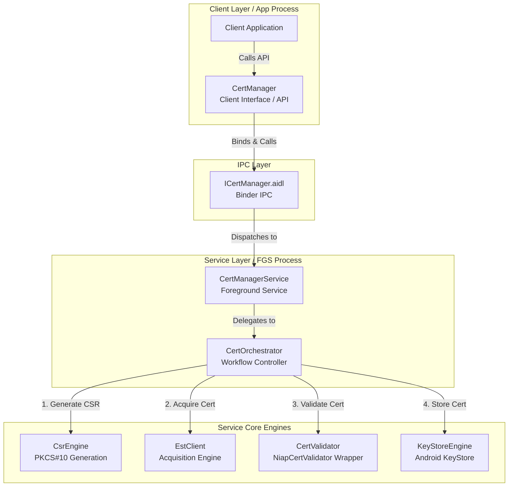
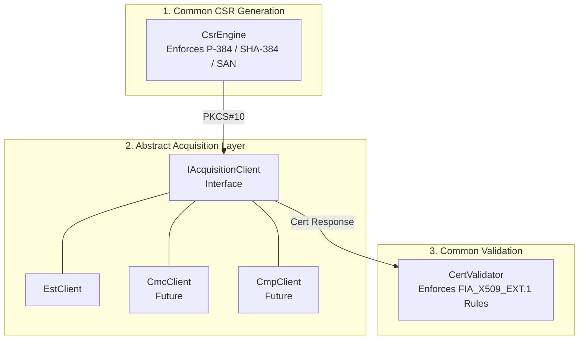
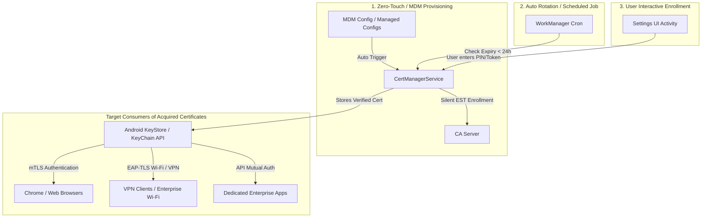
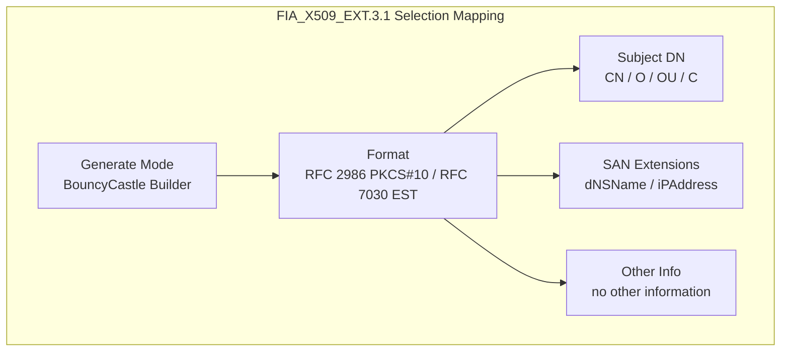
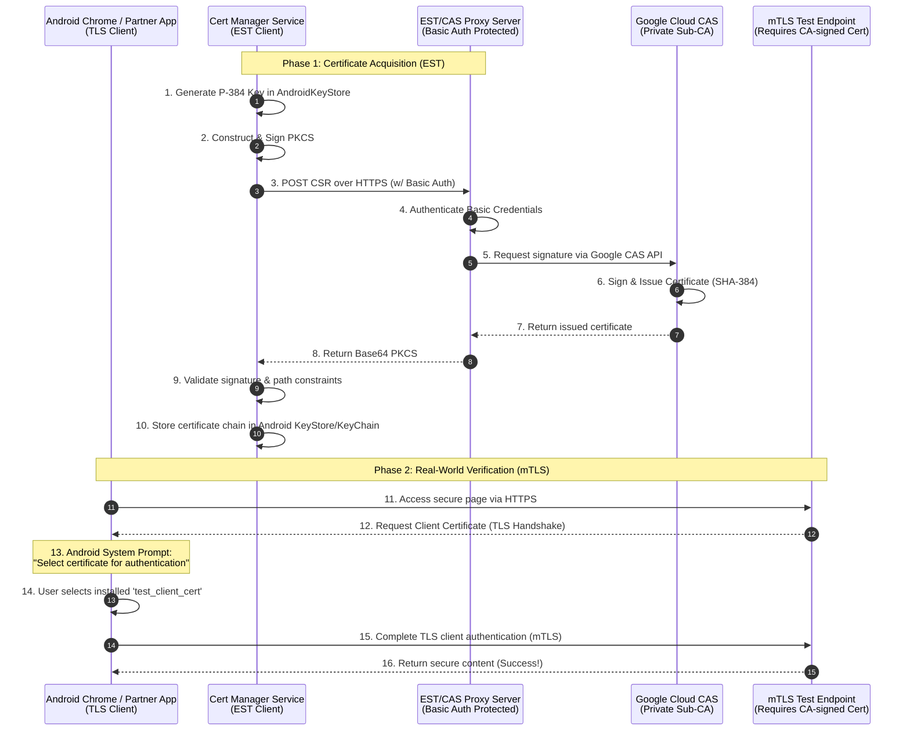

# cert-manager Architecture & Design

## 1. Component Architecture (Client, IPC, Service)

## 2. Protocol-Agnostic Certificate Acquisition Flow

## 3. Operational Use Cases & Enrollment Workflows

### Explanation of Certificate Consumers

Acquired client certificates are stored in the **Android KeyStore** and made available system-wide via Android's `KeyChain API`. This means the certificates managed by `cert-manager` can be utilized across the entire Android device ecosystem:

1.  **Web Browsers (Chrome / Edge / Enterprise Browsers)**: When accessing high-security government or corporate intranet web portals requiring mTLS, Android prompts the user with a certificate selection dialog to authenticate using the acquired certificate.
2.  **Network Security (VPN & EAP-TLS Wi-Fi)**: The stored certificates can be selected in VPN client configurations (e.g., Cisco AnyConnect) or 802.1X Wi-Fi settings for secure network onboarding.
3.  **Dedicated Enterprise Applications**: Other enterprise apps (secure mailers, ERPs) can request access to the certificate via KeyChain for backend API mutual authentication.

## 4. Security Functional Requirements (SFR) Selection & Traceability

To satisfy NIAP Common Criteria (CC) and MDFPP requirements, `cert-manager` enforces strict architectural selections mapped directly to the official SFRs:

### FIA_X509_EXT.3.1 (Certificate Requests)
*   **Generation Mode**: `[generate]`
    *   *Implementation*: The TOE module directly generates the PKCS#10 ASN.1 structure and DER encoding using Bouncy Castle (`JcaPKCS10CertificationRequestBuilder`), while leveraging Android KeyStore for secure asymmetric hardware key generation.
*   **Request Protocol/Format**: `[RFC 2986 (PKCS-10), RFC 7030 (EST)]`
    *   *Implementation*: CSRs are strictly formatted as PKCS#10 requests and transmitted over EST `/simpleenroll` endpoints. (CMC and CMP are out of scope).
*   **Subject DN Attributes**: `[O, OU, CN, and assignment: C]`
    *   *Implementation*: Parses and constructs organizational and common name attributes into the X.500 principal structure.
    *   *Note on 'U' Attribute*: In MDFPP requirements, `U` appears as a shorthand representation for `UID` (LDAP User ID: `0.9.2342.19200300.100.1.1`). Bouncy Castle's `BCStyle` natively supports `UID`. `cert-manager` supports `UID` mapping when provided in the subject DN string to fulfill this requirement seamlessly.
*   **Subject Alternative Names (SAN)**: `[rfc822Name, dNSName, directoryName, uniformResourceIdentifier, iPAddress]`
    *   *Implementation*: Bouncy Castle's `GeneralName` core architecture natively supports all standard X.509 v3 SAN tags (Tag 0 through Tag 8). `cert-manager` is capable of constructing and encoding any of these required SAN types (`rfc822Name` for email, `dNSName` for domains, `directoryName` for DNs, `uniformResourceIdentifier` for URIs, and `iPAddress` for IP addresses) into the certificate request extension when provided in the enrollment configuration.
*   **Other Information**: `[no other information]`
    *   *Implementation*: Minimizes attack surface by excluding unnecessary challenge passwords or non-standard attributes.

### FIA_X509_EXT.3.2 (Certificate Path Validation)
*   **Validation Mode**: `[provide functionality]`
    *   *Implementation*: Instead of relying solely on OS defaults, `CertValidator` wraps `NiapCertValidator` to actively enforce SHA-384/P-384 algorithm constraints, basic constraints (non-CA), and EKU rules upon receiving the certificate response.

### FIA_XCU_EXT.2.1 (Certificate Acquisition)
*   **Acquisition Source**: `[request certificates from an external CA]`
    *   *Implementation*: Communicates securely via OkHttp with external enterprise or government CAs (e.g., Cisco EST server) over TLS.
*   **Target Protocol Selection**: `[TLS, IPsec or IKE]`
    *   *Implementation*: While the acquisition transport itself uses TLS (HTTPS), the acquired certificates are stored in Android KeyStore and exposed system-wide via `KeyChain API`. This architecture allows Android OS daemons (VPN clients, IPsec/IKEv2 services like StrongSwan, and Wi-Fi EAP-TLS supplicants) to authenticate network connections using the acquired certificates.
    *   *Server/Gateway Readiness*: Modern enterprise VPN gateways (e.g., Cisco ASA, StrongSwan) natively support EST/SCEP integration. Devices enroll via EST over TLS, then authenticate IPsec tunnels using the acquired hardware-backed certificates.

